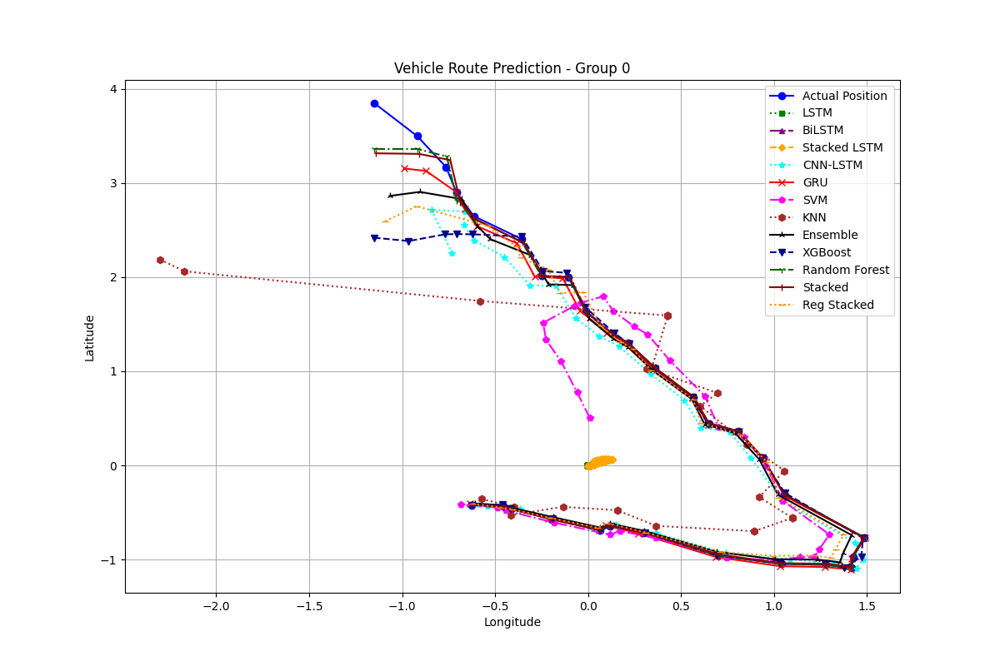
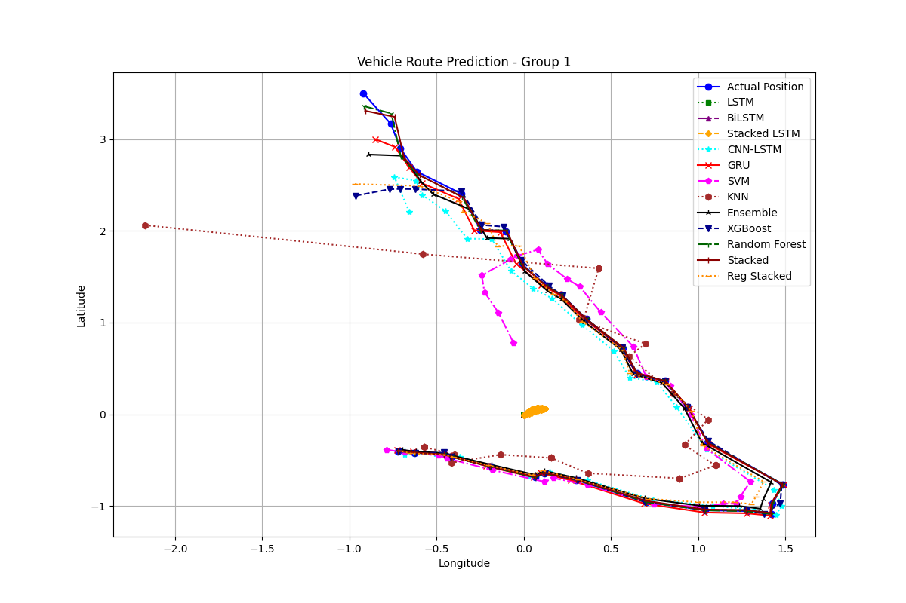
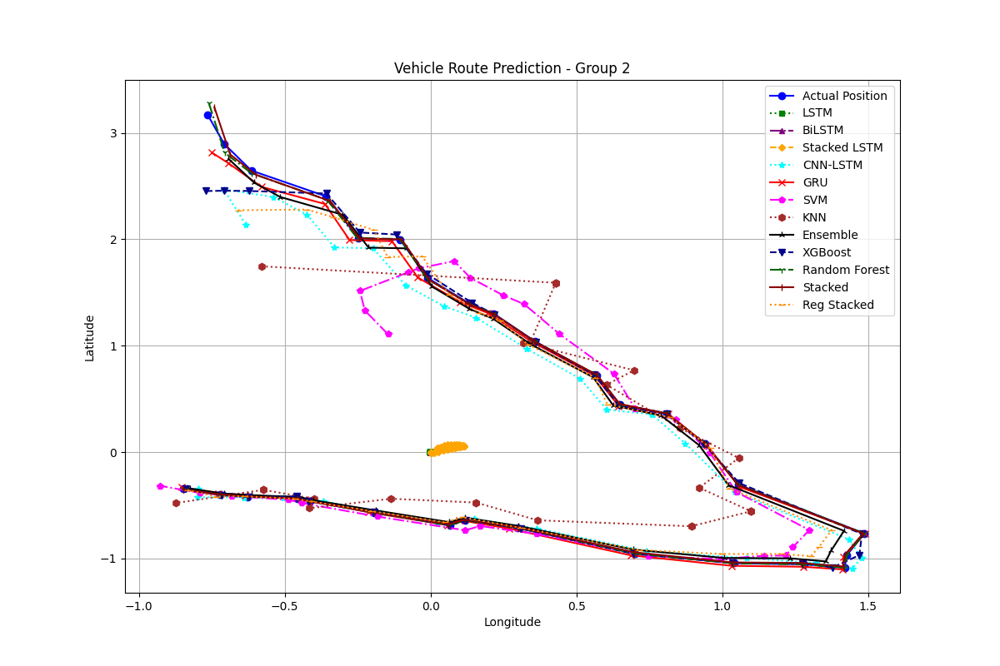
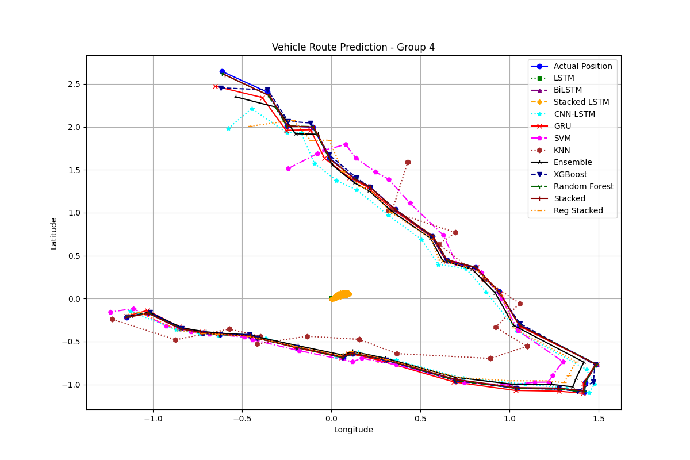

# UrbanFlow: Detailed Overview of All Models and Their Performance

**UrbanFlow** is a smart system designed to manage traffic lights to prioritize emergency vehicles and improve overall
traffic flow. By predicting vehicle routes using various machine learning models, the system aims to enhance urban
traffic management. Here’s a detailed overview of all the models used in the project and their performance, with a focus
on the best-performing ones.

## Performance Metrics

- **MSE (Mean Squared Error):** Measures the average squared difference between predicted and actual values. Lower is
  better.
- **RMSE (Root Mean Squared Error):** The square root of MSE. Lower is better.
- **MAE (Mean Absolute Error):** The average absolute difference between predicted and actual values. Lower is better.
- **R² (Coefficient of Determination):** Indicates how well the model explains the variance in the target variable.
  Higher is better.
- **EVS (Explained Variance Score):** Measures the proportion of variance explained by the model. Higher is better.
- **MAPE (Mean Absolute Percentage Error):** The average absolute percentage difference between predicted and actual
  values. Lower is better.

### Best Performing Models

#### 1. **Random Forest**

Random Forest uses multiple decision trees to make predictions. Each tree gives a prediction, and the final result is a
combination of all these predictions.

- **MSE:** 0.0009
- **RMSE:** 0.0307
- **MAE:** 0.004
- **R²:** 0.999
- **EVS:** 0.999
- **MAPE:** 0.784%

**Performance:** Outstanding. This model makes almost perfect predictions.

#### 2. **XGBoost**

XGBoost is an advanced model that builds multiple trees sequentially, each learning from the mistakes of the previous
ones.

- **MSE:** 0.0057
- **RMSE:** 0.0753
- **MAE:** 0.024
- **R²:** 0.994
- **EVS:** 0.994
- **MAPE:** 4.301%

**Performance:** Excellent. This model is highly accurate and reliable.

#### 3. **Ensemble Model**

An ensemble model combines predictions from multiple models to improve accuracy. It's like getting opinions from various
experts and combining them.

- **MSE:** 0.0040
- **RMSE:** 0.0635
- **MAE:** 0.029
- **R²:** 0.996
- **EVS:** 0.996
- **MAPE:** 4.357%

**Performance:** Outstanding. This model leverages the strengths of multiple models for very high accuracy.

#### 4. **GRU (Gated Recurrent Unit)**

GRU is a type of neural network that is particularly good at predicting sequences, like the future path of a vehicle.

- **MSE:** 0.0035
- **RMSE:** 0.0589
- **MAE:** 0.022
- **R²:** 0.997
- **EVS:** 0.997
- **MAPE:** 5.063%

**Performance:** Outstanding. This model is very good at handling sequential data.

### Other Models

#### 5. **CNN-LSTM**

Combines Convolutional Neural Networks (CNN) and LSTMs. CNNs are great for spatial data, and LSTMs are good for time
series data.

- **MSE:** 0.0115
- **RMSE:** 0.1075
- **MAE:** 0.052
- **R²:** 0.988
- **EVS:** 0.988
- **MAPE:** 13.788%

**Performance:** Excellent. High accuracy and low error.

#### 6. **Stacked LSTM**

Stacked LSTMs have multiple layers of LSTM units, enhancing their ability to capture complex patterns in the data.

- **MSE:** 0.9817
- **RMSE:** 0.9908
- **MAE:** 0.807
- **R²:** 0.018
- **EVS:** 0.018
- **MAPE:** 100.345%

**Performance:** Slightly better than simple LSTM but still poor.

#### 7. **Optimized LSTM**

An optimized version of LSTM aiming for better performance.

- **MSE:** 0.99999
- **RMSE:** 0.99999
- **MAE:** 0.815
- **R²:** ~0
- **EVS:** ~0
- **MAPE:** 99.997%

**Performance:** Very poor, nearly no predictive power.

#### 8. **BiLSTM**

Bidirectional LSTM processes data in both forward and backward directions.

- **MSE:** 0.99997
- **RMSE:** 0.99998
- **MAE:** 0.815
- **R²:** ~0.00003
- **EVS:** ~0.00003
- **MAPE:** 99.909%

**Performance:** Very poor, similar to Optimized LSTM.

#### 9. **SVM (Support Vector Machine)**

SVM finds the best boundary that separates different classes of data.

- **MSE:** 0.0594
- **RMSE:** 0.2436
- **MAE:** 0.089
- **R²:** 0.941
- **EVS:** 0.941
- **MAPE:** 24.444%

**Performance:** Good, relatively high accuracy.

#### 10. **k-NN (k-Nearest Neighbors)**

k-NN predicts the output based on the closest data points.

- **MSE:** 0.0505
- **RMSE:** 0.2247
- **MAE:** 0.139
- **R²:** 0.949
- **EVS:** 0.950
- **MAPE:** 44.521%

**Performance:** Decent, moderate accuracy.

#### 11. **Regularized Stacking**

Combines multiple models with regularization to prevent overfitting.

- **MSE:** 0.0113
- **RMSE:** 0.1065
- **MAE:** 0.049
- **R²:** 0.989
- **EVS:** 0.989
- **MAPE:** 12.998%

**Performance:** Excellent, very high accuracy.

#### 12. **Weighted Average**

Combines predictions of different models, giving different weights to each model.

- **MSE:** 0.0011
- **RMSE:** 0.0327
- **MAE:** 0.005
- **R²:** 0.999
- **EVS:** 0.999
- **MAPE:** 1.107%

**Performance:** Excellent, very high accuracy.

### Performance Summary Chart

| Model                | MSE     | RMSE    | MAE   | R²       | EVS      | MAPE     | Performance |
|----------------------|---------|---------|-------|----------|----------|----------|-------------|
| Random Forest        | 0.0009  | 0.0307  | 0.004 | 0.999    | 0.999    | 0.784%   | Outstanding |
| XGBoost              | 0.0057  | 0.0753  | 0.024 | 0.994    | 0.994    | 4.301%   | Excellent   |
| Ensemble             | 0.0040  | 0.0635  | 0.029 | 0.996    | 0.996    | 4.357%   | Outstanding |
| GRU                  | 0.0035  | 0.0589  | 0.022 | 0.997    | 0.997    | 5.063%   | Outstanding |
| CNN-LSTM             | 0.0115  | 0.1075  | 0.052 | 0.988    | 0.988    | 13.788%  | Excellent   |
| Stacked LSTM         | 0.9817  | 0.9908  | 0.807 | 0.018    | 0.018    | 100.345% | Poor        |
| Optimized LSTM       | 0.99999 | 0.99999 | 0.815 | ~0       | ~0       | 99.997%  | Very Poor   |
| BiLSTM               | 0.99997 | 0.99998 | 0.815 | ~0.00003 | ~0.00003 | 99.909%  | Very Poor   |
| SVM                  | 0.0594  | 0.2436  | 0.089 | 0.941    | 0.941    | 24.444%  | Good        |
| k-NN                 | 0.0505  | 0.2247  | 0.139 | 0.949    | 0.950    | 44.521%  | Decent      |
| Regularized Stacking | 0.0113  | 0.1065  | 0.049 | 0.989    | 0.989    | 12.998%  | Excellent   |
| Weighted Average     | 0.0011  | 0.0327  | 0.005 | 0.999    | 0.999    | 1.107%   | Excellent   |

## Visual Analysis of Predictions

The visual predictions demonstrate a strong alignment with the actual paths across all models, showcasing their
effectiveness in capturing the underlying trends.

### Random Forest

- Closely follows the actual path, indicating high reliability and accurate predictions.
- Displays the best visual alignment among all models, suggesting superior predictive capability.
- Provides accurate predictions, closely following the actual path consistently.

### XGBoost

- Exhibits minor deviations but remains very close to the actual path, confirming its robustness.
- Maintains a very close alignment, further validating its effectiveness.
- Shows high accuracy with only minor deviations across all datasets.

### Ensemble

- Aligns closely with the actual path, reinforcing the accuracy of the ensemble approach.
- Achieves excellent alignment, validating the ensemble method's effectiveness.
- Demonstrates very close alignment with the actual path, echoing the performance of other models.

## Conclusion

The UrbanFlow project shows how different machine learning models can be used to predict vehicle routes and improve
traffic management. The best-performing models, such as Random Forest, XGBoost, Ensemble, and GRU, offer high accuracy
and reliability, making them ideal for optimizing urban traffic flow. Other models, while not as accurate, provide
insights into different approaches to solving the problem.

## Contributing
Contributions to UrbanFlow are welcome! For major changes, please open an issue first to discuss what you would like to change.

## Acknowledgments
- This project was developed as part of the ISEF project by Indradip Paul.
- Special thanks to my mentor for guidance and support.

## License
This project is licensed under the MIT License - see the [LICENSE](LICENSE) file for details.

## Contact
For questions or support, please contact [me](mailto:indradip.paul@outlook.com).
